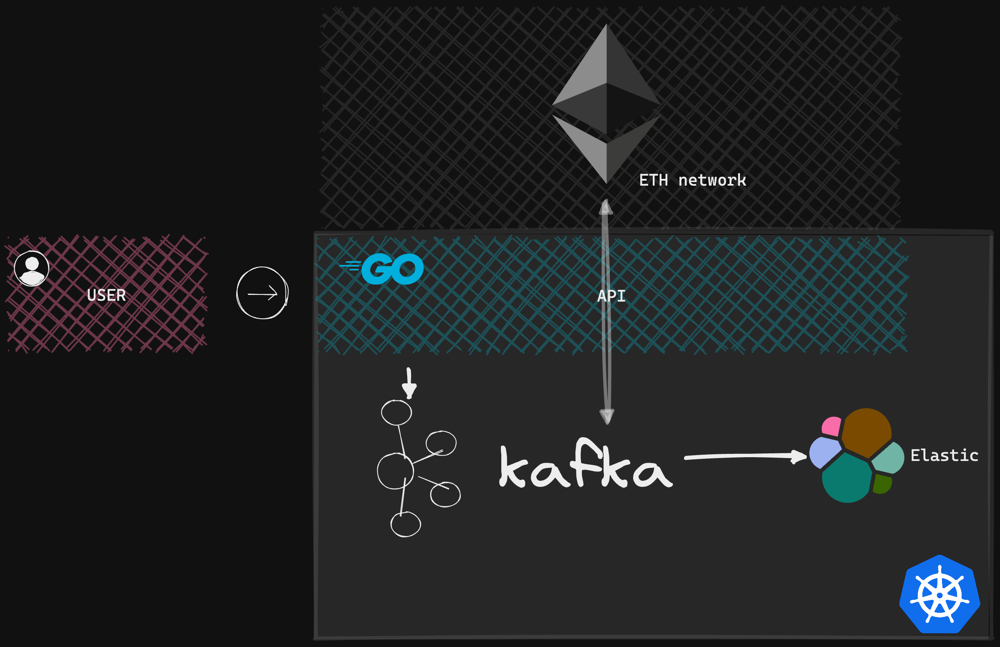

---

# :wave: Setup section
## Initialization
```shell
make dev-init
```
## Reload & start
```shell
make dev-update
```

# :star2: Kafka section

## Create kafka topic example
### Run kafka container
```shell
kubectl exec -it kafka-broker-7dc5d6749d-vgq65 -n kafka -- /bin/bash
```
### Create topic
```shell
kafka-topics.sh --create --topic ethTopic --bootstrap-server localhost:9092 --replication-factor 1 --partitions 3
```

---